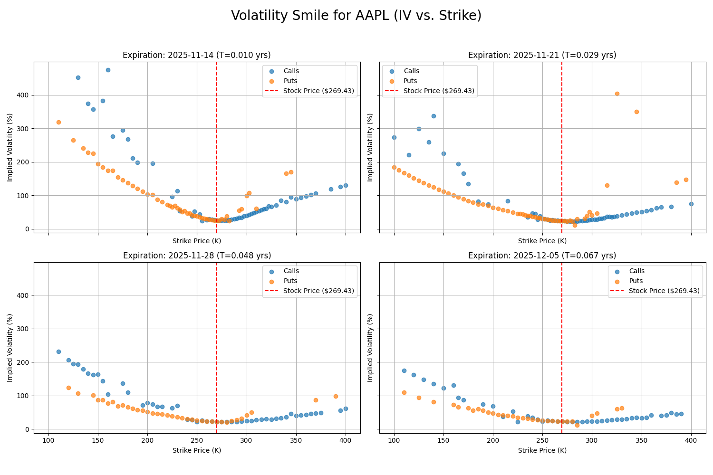
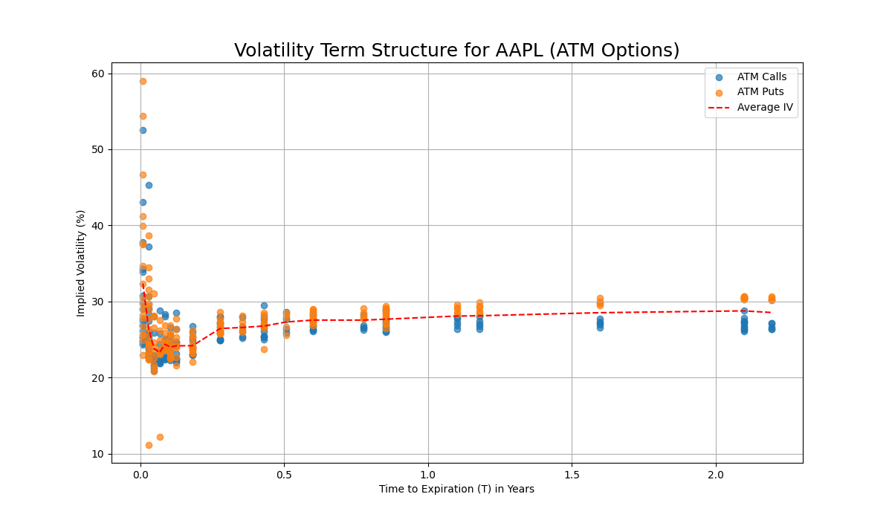

# Quantitative Options Pricing and Analysis Toolkit

A Python-based tool to fetch, price, and analyze equity option chains using Black-Scholes-Merton and Binomial models.

🚀 Key Features

* **Data Pipeline:** Fetches daily options data for any ticker using `yfinance`.
* **Pricing Models:**
    * **Black-Scholes-Merton:** Prices European options and calculates all Greeks (Delta, Gamma, Vega, Theta).
    * **CRR Binomial Tree:** Prices American options and demonstrates convergence.
* **Volatility Analysis:**
    * **Implied Volatility Solver:** Uses the Newton-Raphson method to find IV from market prices.
    * **Volatility Smile:** Plots IV vs. Strike Price to show market skew.
    * **Term Structure:** Plots IV vs. Time to Expiration.
* **Interactive Dashboard:** A `streamlit` web app to visualize all analysis.

## 📸 Screenshots




## 🛠️ How to Use

1.  Clone the repository:
    ```bash
    git clone [Your-GitHub-Repo-URL]
    ```
2.  Create and activate a virtual environment:
    ```bash
    python -m venv venv
    .\venv\Scripts\activate
    ```
3.  Install dependencies:
    ```
    pip install -r requirements.txt
    ```
4.  Run the data pipeline (fetches data and saves to `data/options.db`):
    ```bash
    python src/run_pipeline.py
    ```
5.  Run the analysis (calculates IV/Greeks and saves to `analytics_data` table):
    ```bash
    python src/run_analysis.py --action=calculate
    ```
6.  Launch the dashboard:
    ```bash
    streamlit run src/dashboard.py
    ```